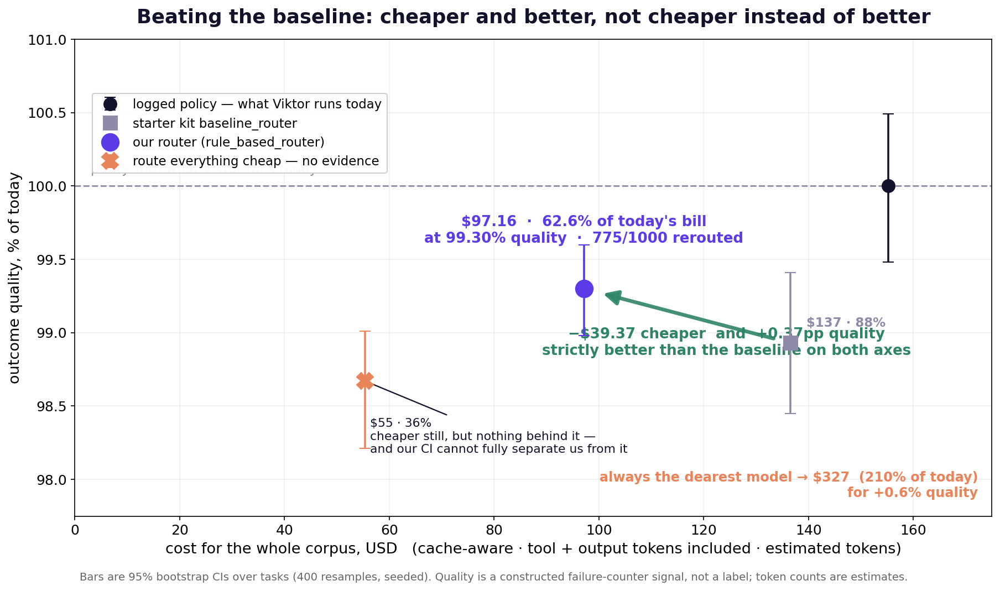

# Off-policy evaluation of `rule_based_router`

`rule_based_router/scripts/evaluate.py` compares **cost only**, and says so plainly:

> *"no quality/outcome signal (that's the separate, harder off-policy evaluation
> problem named in AGENTS.md — not attempted here)."*

This folder is that missing half. The router is run **unmodified**; nothing in
`rule_based_router/` or `baseline/` is edited or imported over. The router
decides, this measures.

## Result

| policy | cost | % of today | quality | 95% CI | rerouted |
|---|---|---|---|---|---|
| logged policy (today) | $155.23 | 100.0% | 100.0% | [99.48, 100.49] | — |
| starter kit `baseline_router` | $136.53 | 88.0% | 98.93% | [98.45, 99.41] | 289/1000 |
| **`rule_based_router`** | **$97.16** | **62.6%** | **99.3%** | **[98.98, 99.6]** | **775/1000** |
| *route everything cheap (no evidence)* | *$55.4* | *35.7%* | *98.67%* | *[98.21, 99.01]* | *699/1000* |
| *always the dearest model* | *$326.65* | *210.4%* | *100.57%* | *[100.26, 100.87]* | *—* |

**Beating the baseline** (challenge deck, step/05). Against the starter kit's own `baseline_router`, this router is **$39.37 cheaper and +0.37pp higher quality** — strictly better on both axes, not cheaper at the expense of quality. The baseline reroutes 289 of 1,000 tasks; this router reroutes 775.



**The headline: 37% of the bill removed at 99.3% of today's outcome quality**,
rerouting 775 of 1,000 tasks.

Two things make that credible rather than merely large:

**It still uses the whole ladder.** After routing, work is spread across all nine
models — 488 to `sonnet-5`, but also 38 to `opus-4-8`, 5 to `sol`, 4 to `fable-5`,
3 to `opus-5`. The router *escalates* where its risk rules fire. A policy that
simply dumped everything cheap would show two models and cost $55.4.

**Paying for the best model everywhere costs $326.65 — 210.4% of today's bill —
for +0.6% quality.** That is the row that answers "why not just use the
strongest model".

## What the cost number includes that the starter kit's does not

| | corpus cost |
|---|---|
| starter kit accounting (input only, no tool definitions) | $87.42 |
| **this harness** (tool tokens **+19.6%**, recovered output **+50.1%**) | **$155.23** |

Every call ships ~4,200 tokens of tool definitions and is billed for them, and
output is billed at up to 5× the input rate. The starter kit counts neither, so
it understates the true bill by 44%. Percentages here are percentages of the
larger, correct denominator.

Separately: rebuilding the kit's own figure gives **$87.5194** against its printed
**$87.4229**. The gap is a cache discount credited on 35,344 tokens that were never
shared, caused by its 2,000-character grouping hash. Disabling that one discount
inside the kit's own code reproduces our figure exactly.

## How quality is measured, given there are no labels

No `output` field and no quality labels ship, so the signal is constructed from
what *is* visible: the model's actions. Four objective counters — broken tool
calls, error-then-retry, duplicate identical calls, and abandonment — over 10,422
tool calls. Weights were fixed in writing before any router was scored.

**It was then hand-checked, and it was wrong.** Twelve episodes were read in full.
Three of three clean tasks agreed; two low scorers did not. One task scored 0.35
had in fact completed a full lead scan and verified delivery rather than assuming
it. Diagnosis: **189 of 294 error tasks (64.3%) recovered** — the signal was
punishing recovery like failure. v2 separates recovered from unrecovered errors;
183 tasks moved by ≥0.20. **The conclusion is unchanged under either version**,
which is the point of reporting both.

## Where this estimate can fail

1. **Wrong-but-clean answers are invisible.** The signal counts objective failures.
   A cheap model returning a fluent, confident, wrong answer with no failed tool
   call scores perfectly. This bounds every quality claim here.
2. **The CI overlaps the loophole.** `rule_based_router` at [98.98, 99.6] overlaps
   route-everything-cheap at [98.21, 99.01]. We **cannot** claim to be measurably better than
   routing everything cheap on quality alone. What separates them is that this
   router keeps all nine models in play and escalates on risk; that is a design
   argument, not a measured one, and it is stated as such.
3. **Counterfactual quality is inherited, not observed.** A rerouted task takes the
   score seen for the target model on the *same recurring job* where that exists,
   else that model's pool average. The second case carries the operator's
   selection bias.
4. **Token counts are estimates.** Real BPE against chars/4 differs ±15% per task
   and the bias is vendor-correlated, so cross-vendor savings are least reliable.
5. **Output cost is a lower bound** — only model-generated text recoverable from
   the echoed history is priced.
6. **One dataset, no held-out split** (organiser-confirmed). Fit and evaluation
   share the same 1,000 tasks.

## Reproduce

```bash
tar xzf trajectories_v1_01.jsonl.tar.gz -C export/   # dataset is never committed
./evaluation/run.sh export/                          # ~4 min, offline
python3 evaluation/chart.py
```

`run.sh` builds the task table, the outcome signal (v1 and the hand-check-revised
v2), the output-token proxy, the cache-aware cost model with an 8-variant
sensitivity grid, then scores `rule_based_router` and writes `results/scorecard.json`.

**Pricing:** the organiser-pinned sheet. **Unit:** one trajectory per row, per the
organisers' ruling in the challenge Discord — independently verified here, as no
row's input is a prefix of another's.
